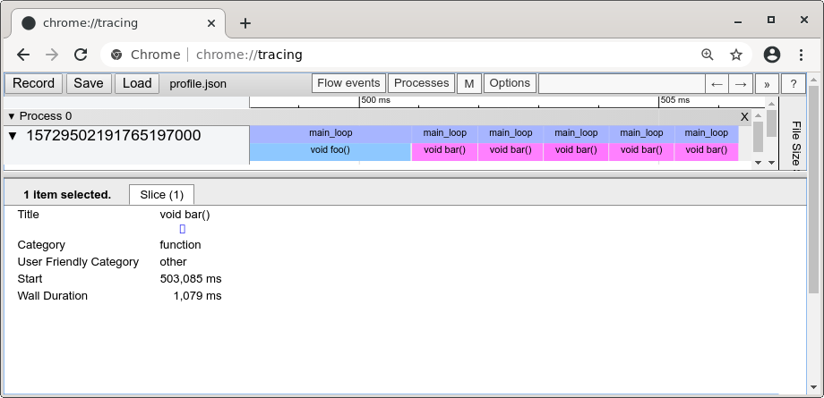

# Profiler

A lightweight profiler made in C++11 (and header-only).

A profiler allows you to measure the time spend in your functions and help you to see bottleneck points of your code. This profiler generates a JSON file which can be loaded by the tracer embedded in the Google browser Chrome which will render a timeline.



This project is adapted from the originaly made by TheCherno presented in https://www.youtube.com/watch?v=xlAH4dbMVnU (https://github.com/TheCherno/Hazel). If you want a more serious profilers you have:
* the very saggy gprof but with the drawback that you have to compile your application against it and the second drawback is the generated logs not really user friendly.
* the excellent modern profiler [Tracy](https://bitbucket.org/wolfpld/tracy/src/master/) but with the drawback is to be complex to set up.

If you want to quickly profile your software "back of the envelope", without deploying complex environement needing to read heavy documentation, you can use this profiler. Beware! Due to of this simplicity, this profiler is not thread safe but you can easily add the missing mutex.

## Prerequisite

Google chrome with the plugin 'tracing'. Beware some distribution, such as Debian, do not offer Chrome with this plugin.

## How to use this profiler

* Copy/paste the file `Profiler.hpp` in your project.
* Call `START_PROFILING("session name", "path/to/your/file.json")` to start a new profiling session. Beware the file is erased when opened!
* Add `PROFILE_FUNCTION()` in each of your C functions or C++ methods you want to profile.
* Add `PROFILE_SCOPE("name of the scope")` in each of your desired scopes (ie inside loops or inside a `{ }`). Scopes need to be named.
* Optinally call `STOP_PROFILING()` for halting profiling.
* Run your application. The generated JSON file shall have been created.
* To load the JSON file type in Chrome, type the url `chrome://tracing/` and select the file.

Do not release or commit your application with code holding profile functions.

Example to be compiled `g++ -W -Wall --std=c++11 example.cpp -o prog`:
```
#include "Profiler.hpp"
#include <unistd.h> // sleep

static void foo()
{
   PROFILE_FUNCTION();
   printf("%s", "foo\n");
   usleep(100000);
}

static void bar()
{
   PROFILE_FUNCTION();
   printf("%s", "bar\n");
   usleep(1000);
}

// g++ -W -Wall --std=c++11 example.cpp -o prog
int main()
{
  START_PROFILING("HelloWord", "profile.json");

  for (int i = 0; i < 10; ++i)
  {
    PROFILE_SCOPE("main_loop");
    if (i < 5) { foo(); } else { bar(); }
  }

  STOP_PROFILING();
  return 0;
}
```

This will output [this JSON file](doc/profile.json). Dragging it on Chromium tracing will
display the previous screenshot.
